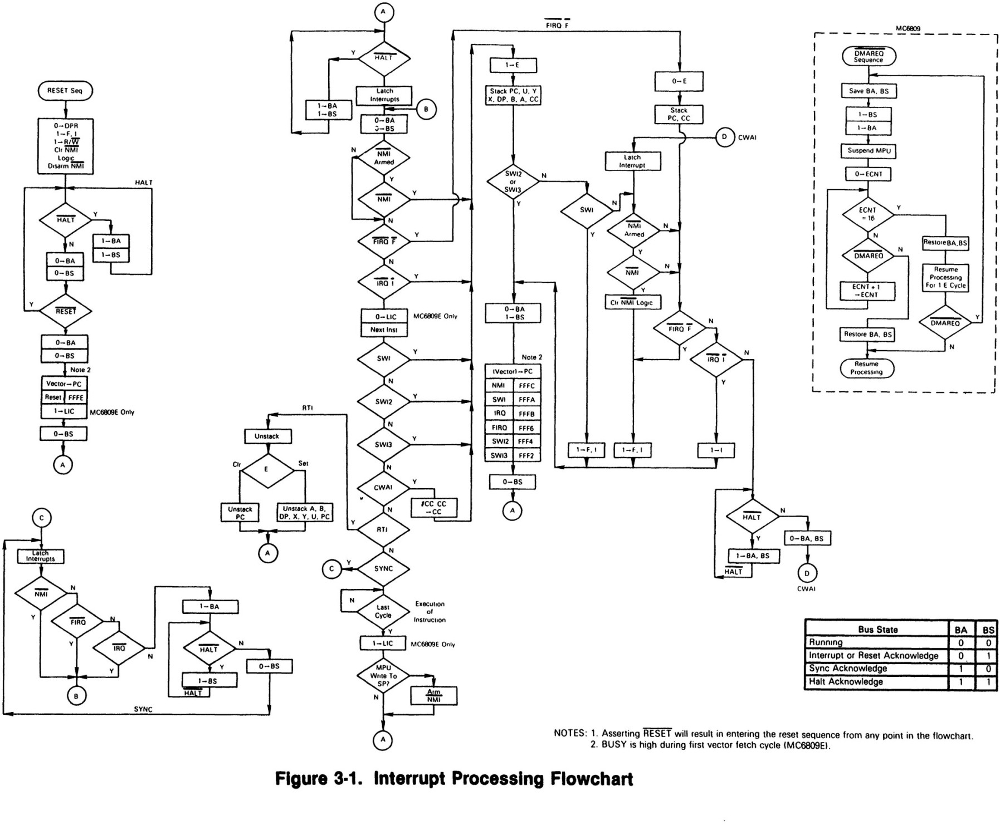

# SBC 6309 PLAN #

## Bootstrap

establish initial state
populate S register (enables NMI) as last step

$FFF0 - $FFFF **must** contain the initial bootstrap vectors

| address range | purpose |
| ------------- | ------- |
| $FFFE-FFFF    | Reset   |
| $FFFC-FFFD    | NMI     |
| $FFFA-FFFB    | SWI     |
| $FFF8-FFF9    | IRQ     |
| $FFF6-FFF7    | FIRQ    |
| $FFF4-FFF5    | SWI2    |
| $FFF2-FFF3    | SWI3    |
| $FFF0-FFF1    | Exception (6309) |

## Reset Routine
* test first 4 bytes - if known pattern go to
warm start
* populate system variables in first 256 bytes (direct page zero)
* init device 0 (serial rs232)
* init device 1 (sd)
* init device 2 (flash)
* init display (mode 0, base address)
* write welcome message
* enter CLI cycle

need timed interrupt cycle to trigger keyboard polling cycle

## Kernal
* Keyboard API
* Display API
* File API
* Comms API
* Monitor

### Keyboard
* get next key pressed ()(A)
* is key pressed (A)(true/false)
* wait for key press ()(A)

#### Get Next Key Pressed
* examine key input buffer and return head in A
* remove head

#### Is Key Pressed (0)
* examine rollover table and return true if any
key pressed

#### Is Key Pressed (A)
* examine rollover table and return true if specified key pressed

#### Wait For Key Press - blocking
* return first key pressed in A

### Display
* init display () - general call all required routines with defaults
* set mode (A) - 0 = badvga (no other modes supported yet)
* set register (A,B) - assumes complex VDC
* set base (D) - define base address of screen ram
* set cursor (D) - set screen cursor position
* write char (A) - write char A to cursor position (and advance position)
* write string (D) - write null terminated string at D to screen at cursor position
* blank screen (A) - set screen to character A
* scroll (A) - scroll A lines
* putcr () - newline

#### Init Display
* define screen registers (base address, mode)
* set mode (mode)
* set base (base address)
* blank screen (32)
* set cursor (0,0)

#### Set Mode (A = mode)
* define screen memory length required for mode
* override base address if required (mode 0 base is fixed)
* set any required registers (none for mode 0)

#### Set Base (D = address)
* set base memory offset for display

#### Blank Screen (A = char)
* write supplied byte to entire screen display

#### Set Cursor (A = y, B = x)
* define x,y position on screen

#### Write Char (A = char)
* write supplied byte to screen at cursor
* advance cursor

#### Scroll (A = lines to scroll)
* copy bottom N-A lines to top
* clear bottom A lines

### File / Comms
* open file (device, IO, name)(id,true/false)
* close file (id)
* write buffer (id, len)
* read buffer (id)(len)
* set buffer base (address)

## Reference code
[https://github.com/davidlinsley/DragonBasic] 
[https://github.com/prime6809/DragonRom] 



### Keyboard routines from D64
```asm
*
* ROUTINES USED BY THEKEYBOARD POLLER FOLLOW
*
* CHKROW - CHECKS ROWS OF K/B MATRIX FOR CLOSURE
*
CHKROW LDB    P0PDRA   READ ROW DATA
       ORB    #$80     SET UNUSED BIT
       TST    P0PDRB   SHIFT KEY IS
       BMI    NOSHFT   IS MASKED OUT
       ORB    #$40     BY THIS
NOSHFT RTS
*
* CSHIFT - CHECKS THE STATE OH THE SHIFT KEY, Z = 1 IF PRESSED
*
CSHIFT LDB    #$7F     CLEAR TOP BIT
       STB    P0PDRB   OF THE COLUMNS
       LDB    P0PDRA   THEN READ ROWS
       ANDB   #$40     MASK OFF ALL BUT SHIFT KEY
       RTS
*
* POLCAT - POLL THE K/B AND RETURN CHARACTER IN (A)
*
       XDEF   ZPOLCA
ZPOLCA EQU    *
POLCAT PSHS   B,X      SAVE REGS
       BSR    POLLKB   POLL AND ENCODE KEYS
       JMP    KEYINT   INITILISE REPEAT COUNTDOWN
*
* POLLKB - POLLS THE K/B, DETECTS KEY CLOSURES, DEBOUNCES KEYS, PERFORMS
* ROLLOVER AND ENCODES CHARACTERS
*
POLLKB LEAS   -2,S     RESERVE 2 BYTES OF WORKSPACE ON STACK
       LDX    #KBROLL  SET UP ADDRESS OF KB ROLLOVER TABLE
* THE FIRST THING TO DO IS TO CHECK FOR ANY KEY CLOSURES WHATSOEVER
       CLR    P0PDRB   FORCE 0'S TO ALL COLUMNS
       LDB    P0PDRA   READ ROW STATUS
       ORB    #$80     SET UNUSED BIT
       CMPB   0,X      CHECK FOR ANY KEYBOARD ACTIVITY
       BEQ    NONKEY   IF THE SAME THEN NO CHANGE
* SOME CHANGE HAS BEEN DETECTED AT THIS POINT SO NEXT THING TO DO
* IS TO MAKE SURE THAT IT WASN'T THE JOYSTICK BUTTONS.
       TFR    B,A      SAVE ROW STATUS
       COM    P0PDRB   FORCE 1'S TO COLUMNS
       BSR    CHKROW   CHECK FOR JOYSTICK BUTTONS
       CMPB   #$FF     AS 0'S ON THE PA0 OR PA1
       BNE    NONKEY   MEAN BUTTONS ARE DOWN
       STA    0,X+     SAVE FULL ROW STATE IN ROLLOVER TABLE
* AT THIS POINT A CHANGE IN THE STATE OF THE ROWS HAS BEEN DETECTED
* SO THE FOLLOWING CODE IS USED TO DETECT WHICH KEY IT WAS
       CLR    0,S      RESET COLUMN COUNT
       LDB    #$FE     SET UP 0 IN LS BIT
       STB    P0PDRB   AND SEND OUT TO MATRIX COLUMNS
SCANKB BSR    CHKROW   CHECK ROW CLOSURES
       STB    1,S      SAVE ROW STATE AWAY
       EORB   0,X      PERFORM KEY CLOSURE AND ROLLOVER DETECTION
       ANDB   0,X      BIT SET IN B IF IT DIFFERED FROM LAST TIME
       LDA    1,S      RESTORE ROW STATE AND
       STA    0,X+     SAVE IN ROLLOVER TABLE FOR NEXT TIME
       TSTB            ANY CHANGES TO KEYS?
       BNE    DEBKEY   YES, DEBOUNCE BEFORE ENCODING
       INC    0,S      ELSE UPDATE COLUMN COUNT
       COMA            USED TO SET CARRY BIT
       ROL    P0PDRB   BEFORE SHIFTING 0 T0 NEXT COLUMN
       BCS    SCANKB   REPEAT UNTIL ALL DONE OR CLOSURE FOUND
       BRA    NONKEY   MUST HAVE BEEN NO KEYS FOUND
* KEY FOUND - DEBOUNCE IT
DEBKEY LDX    KBDLAY   WAIT DEBOUNCE PERIOD
       BSR    IXDLAY   BEFORE RE-CHECKING KB
       EXG    A,B      COPY ORIGINAL KEY CLOSURE
       BSR    CHKROW   AND GET NEW STATE
       CMPB   1,S      AND COMPARE WITH ORIGINAL
       EXG    A,B      RESTORE KEY CLOSURE
       BNE    NONKEY   IF NO MATCH NO KEY RETURNED
* MUST BE A VALID KEY AT THIS POINT SO ENCODE IT
       LDA    0,S      PICK UP COLUMN COUNT
       SUBA   #COLS    OFFSET IT
NXTROW ADDA   #COLS    CALCULATE KEY POSITION AS FOLLOWS
       LSRB            KEY POS = (ROWPPOS)*(COLS) + (COL POS)
       BCC    NXTROW   ROW POS = BIT SET IN (B)
       TSTA            KEY POS = 0 IS A
       BEQ    KEY0     SPECIAL CASE
       CMPA   #$0C     CHECK NUMERIC KEY RANGE
       BLO    NUMKEY   WHICH IS $00 - $0B
       CMPA   #$11     CHECK SPECIAL CASE RANGE
       BLO    SPEC1    WHICH IS $0C - $10
       CMPA   #$2A     AND FINALLY CHECK RANGE
       BHI    SPEC2    $2B ONWARDS SPECIAL CASE
* MUST BE ALPHABETIC CHARACTER IF HERE
       ADDA   #$30     ADD OFFSET FOR ASCII UPPER CASE
       BSR    CSHIFT   AND CHECK WHETHER TO SHIFT
       BEQ    CODED    IF SHIFT THEN UPPER CASE REMAINS
* COULD BE LOWER CASE AT THIS POINT SO CHECK ALPHA LOCK
       TST    ALLOCK
       BNE    CODED    IF ON THEN UPPER CASE OK
       ORA    #$20     ELSE CONVERT TO LOWER CASE
       BRA    CODED    BEFORE EXIT
* NUMERIC (+ OTHERS) ENCODED HERE
NUMKEY ADDA   #$30     CONVERT TO ASCII
       LBSR   CSHIFT   CHECK SHIFT KEY
       BNE    CODED    UNSHIFTED - NO CHANGE
       SUBA   #$10     ELSE CONVERT TO UPPER SET
CODED  CMPA   #SHIFT0  CHECK FOR ALPHA LOCK TOGGLE
       BNE    POLEND
       COM    ALLOCK   TOGGLE IF FOUND
NONKEY CLRA            NO KEY CLOSURE EXIT CONDITION
POLEND PULS   X,PC     TIDY UP WORKSPACE AND RETURN
* SPECIAL CASES FOLLOW
SPEC2  SUBA   #26      MAKE SPECIAL CASES CONTIGUOUS
SPEC1  SUBA   #11      AND OFFSET IN RANGE 1 ->
KEY0   ASLA            2 ENTRIES/KEY
       LBSR   CSHIFT   CHECK FOR SHIFTED SET
       BNE    LOOKUP
       INCA            SHIFTED SET ENTRY OFFSET
LOOKUP LDX    #KEYTAB  SET UP LOOKUP TABLE BASE
       LDA    A,X      LOOKUP KEY ENTRY
       BRA    CODED    AND RETURN IT
* KEY CODE LOOKUP TABLE FOLLOWS
* SECOND ENTRY OF EACH IS THE SHIFTED KEY
KEYTAB FCB    '0,SHIFT0
       FCB    ',,'<
       FCB    '-,'=
       FCB    '.,'>
       FCB    '/,'?
       FCB    '@,$13
       FCB    $5E,$5F  UP ARROW
       FCB    LF,$5B   DOWN ARROW
       FCB    BS,$15   LEFT ARROW
       FCB    $09,$5D  RIGHT ARROW
       FCB    SP,SP    SPACE
       FCB    CR,CR    ENTER
       FCB    $0C,$5C  CLEAR
       FCB    $03,$03  BREAK
```
